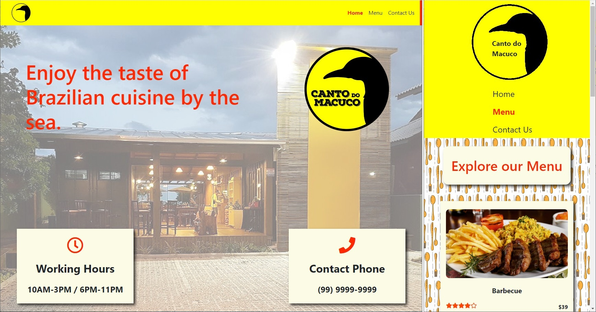

[![Contributors][contributors-shield]][contributors-url]
[![Forks][forks-shield]][forks-url]
[![Stargazers][stars-shield]][stars-url]
[![Issues][issues-shield]][issues-url]

# Restaurant

On this project I applied the concepts of Webpack and JS DOM manipulation to build all content on an empty HTML, it is a responsive front end design for a restaurant page. 
The project shows a restaurant with three tabs to navigate, Home, Menu - with some dishes - and a Contact tab with a form. 
On the menu, it is possible to rate the dishes from 1 to 5 stars.



## Table of Contents

* [Features](#features)
* [Live Demo](#demo)
* [Installation](#installation)
* [Built With](#built-with)
* [Contributing](#contributing)
* [Acknowledgments](#acknowledgments)
* [Authors](#author)
* [License](#license)

## Features
 - The project was created using webpack.
 - The page is built only with JS using DOM manipulation.
 - The navbar loads the 3 different contents for the page.
 - All content is responsive.
 - The Menu frontend is prepared with JS functions to rate each dish from 1 to 5 stars.

## Demo

[Live Demo](https://raw.githack.com/Stricks1/restaurant/feature-restaurant/dist/index.html)

## Installation

You can get a local copy of the repository please run the following commands on your terminal:
```
$ cd <folder>
$ git clone git@github.com:Stricks1/restaurant.git
```

## Built With
- Javascript
- HTML
- CSS
- Webpack

## Contributing

Contributions, issues and feature requests are welcome!

You can do it on [issues page](issues/).

## Acknowledgments

Special thanks to code reviewers.

## Show your support

Give a ⭐️ if you like this project!

## Author

👤 **Gabriel Malheiros Silveira**

- Github: [@Stricks1](https://github.com/Stricks1)
- Linkedin: [Gabriel Silveira](https://linkedin.com/in/gabriel-malheiros-silveira/)
- Twitter: [@Gabriel_Stricks](https://twitter.com/Gabriel_Stricks)

## License

<strong>Creative Commons 2020</strong>

<!-- MARKDOWN LINKS & IMAGES -->

[contributors-shield]: https://img.shields.io/github/contributors/stricks1/restaurant.svg?style=flat-square
[contributors-url]: https://github.com/stricks1/restaurant/graphs/contributors
[forks-shield]: https://img.shields.io/github/forks/stricks1/restaurant.svg?style=flat-square
[forks-url]: https://github.com/stricks1/restaurant/network/members
[stars-shield]: https://img.shields.io/github/stars/stricks1/restaurant.svg?style=flat-square
[stars-url]: https://github.com/stricks1/restaurant/stargazers
[issues-shield]: https://img.shields.io/github/issues/stricks1/restaurant.svg?style=flat-square
[issues-url]: https://github.com/stricks1/restaurant/issues